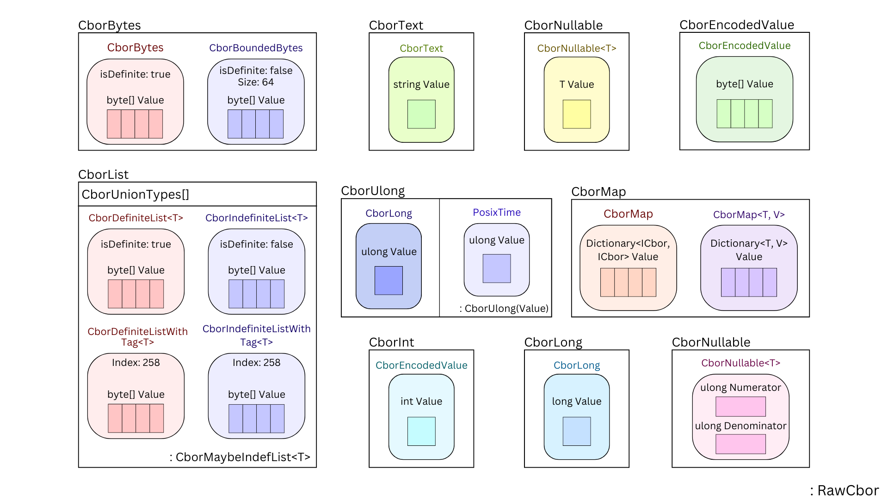

<div align="center">
    <h1 style="font-size: 3em;">Chrysalis: Cardano Serialization Library for .NET 🦋</h1>
    <h4>A .NET Serialization Library for Cardano</h4>
</div>

<div align="center">

 
 


 
 
 

</div>


Chrysalis is an open-source .NET library designed to help you create, build, and sign Cardano transactions. As a C# serialization library, Chrysalis facilitates the serialization and deserialization of Cardano blockchain data structures. With a strong focus on adhering to the Cardano standards and enhancing the .NET Cardano developer ecosystem, Chrysalis aims to provide developers with a reliable and consistent toolkit for working with Cardano. 

🚧 **NOTE:** This library is currently a work in progress. Feedback and contributions are welcome!

## Features ✨

- **Cardano Serialization**: Convert Cardano blockchain data structures to and from CBOR (Concise Binary Object Representation), allowing seamless and efficient data exchanges while reducing manual handling. 
- **Utility functions**: Use provided functions to intuitively interact with the Cardano data types and serialization formats.
    - **Bech32 Address Encoding/Decoding**: Simplifies the encoding and decoding of Cardano addresses, ensuring compatibility with widely used formats. This allows you to handle Cardano addresses seamlessly.
- **Extension Functions**: Simplifies the retrieval of values from Cardano data types by providing functions to access various variables within the data structures.
- **Extensive Data Model Support**: Use a wide range of pre-built Cardano data types, including Transactions, Assets, MultiAssets, and more.
- **Smart Contract Interaction**: Utilize Chrysalis' Cbor types in Datum creation and interact with Cardano smart contracts.
- **Cross-Platform Compatibility**: Use Chrysalis in any .NET project, including .NET Core, .NET Framework, Xamarin, and more. This not only allows you to assemble Cardano data through C# but other .NEt languages such as F# or VB.NET.


## Roadmap 🚀

1. **(De)serialization Support**: Achieve complete serialization and deserialization for any Cardano data type described in CDDL https://github.com/IntersectMBO/cardano-ledger/blob/master/eras/conway/impl/cddl-files/conway.cddl.
2. **Transaction Handling**: Introduce capabilities for building and signing Cardano transactions.
3. **Advanced Address Management**: Implement address generation, derivation, and other associated functionalities.

## Getting Started 📦

To use Chrysalis in your .NET project:

1. You can install Chrysalis via NuGet:
    `dotnet add package Chrysalis`

2. Example Usage 🧑‍💻
    
    CBOR (De)serialization
    ```csharp
        var serializedTransaction = CborSerializer.Serialize(originalTransaction);
        var deserializedTransaction = CborSerializer.Deserialize<TransactionBody>(serializedTransaction);
    ```

    Block Deserialization and Serialization
    ```csharp
        byte[] serializedBlock = CborSerializer.Serialize(originalBlock);
        BlockEntity deserializedBlock = CborSerializer.Deserialize<BlockEntity>(serializedBlock);
    ```

    Access Deserialized Transactions, Transaction Inputs, and Transaction Outputs from a Deserialized Block
    ```csharp
        IEnumerable<TransactionBody> transactions = originalBlock.TransactionBodies();
        foreach (TransactionBody tx in transactions)
        {
            IEnumerable<TransactionInput> inputs = tx.Inputs();
            IEnumerable<TransactionOutput> outputs = tx.Outputs();    
        }
    ```

    Access a Transaction Input's Transaction Id and Index
    ```csharp
        foreach (TransactionInput input in tx.Inputs())
        {
            string id = input.TransacationId();
            ulong index = input.Index();
        }
    ```

    Access a Transaction Output's Address and Balance
    ```csharp
        foreach (TransactionOutput output in tx.Outputs())
        {
            string addr = output.Address().Value.ToBech32();
            Value balance = output.Amount();
            ulong lovelace = balance.Lovelace();
            MultiAssetOutput multiasset = balance.MultiAsset();
        }
    ```

    Serialize Transactions in a Block
    ```csharp
        for (uint x = 0; x < transactions.Count(); x++)
        {
            CborSerializer.Serialize(transactions.ElementAt((int)x))
        }
    ```

    Bech32 Address Encoding or Decoding
    ```csharp
        var addressBech32 = "addr...";
        var addressObject = Address.FromBech32(addressBech32);
        var addressBech32Again = addressObject.ToBech32();
        var paymentKeyHash = addressObject.GetPaymentKeyHash();
        var stakeKeyHash = addressObject.GetStakeKeyHash();
    ```

## Smart Contract Datums 📝
Cbor Types


Datum Example
```csharp
    public record AssetClass(CborBytes[] Value) : CborIndefiniteList<CborBytes>(Value);
    public record AssetClassTuple(AssetClass[] Value) : CborIndefiniteList<AssetClass>(Value);

    [CborSerializable(CborType.Constr, Index = 0)]
    public record SundaeSwapLiquidityPool(
        [CborProperty(0)]
        CborBytes Identifier,
        
        [CborProperty(1)]
        AssetClassTuple Assets,
        
        [CborProperty(2)]
        CborUlong CirculatingLp,
        
        [CborProperty(3)]
        CborUlong BidFeesPer10Thousand,
        
        [CborProperty(4)]
        CborUlong AskFeesPer10Thousand,
        
        [CborProperty(5)]
        Option<MultisigScript> FeeManager,
        
        [CborProperty(6)]
        CborUlong MarketOpen,
        
        [CborProperty(7)]
        CborUlong ProtocolFees
    ) : RawCbor;
```

## How to Contribute 🤝

Interested in contributing to Chrysalis? Great! We appreciate any help, be it in the form of code contributions, documentation, or even bug reports.

- **Fork and Clone**: Fork this repository, clone it locally, and set up the necessary development environment.
- **Branch**: Always create a new branch for your work.
- **Pull Request**: Submit a pull request once you're ready. Ensure you describe your changes clearly.
- **Feedback**: Wait for feedback and address any comments or suggestions.

## License ⚖️

MIT License

Copyright (c) 2023 0xAccretion

Permission is hereby granted, free of charge, to any person obtaining a copy of this software and associated documentation files (the "Software"), to deal in the Software without restriction, including without limitation the rights to use, copy, modify, merge, publish, distribute, sublicense, and/or sell copies of the Software, and to permit persons to whom the Software is furnished to do so, subject to the following conditions:

The above copyright notice and this permission notice shall be included in all copies or substantial portions of the Software.

THE SOFTWARE IS PROVIDED "AS IS", WITHOUT WARRANTY OF ANY KIND, EXPRESS OR IMPLIED, INCLUDING BUT NOT LIMITED TO THE WARRANTIES OF MERCHANTABILITY, FITNESS FOR A PARTICULAR PURPOSE AND NONINFRINGEMENT. IN NO EVENT SHALL THE AUTHORS OR COPYRIGHT HOLDERS BE LIABLE FOR ANY CLAIM, DAMAGES OR OTHER LIABILITY, WHETHER IN AN ACTION OF CONTRACT, TORT OR OTHERWISE, ARISING FROM, OUT OF OR IN CONNECTION WITH THE SOFTWARE OR THE USE OR OTHER DEALINGS IN THE SOFTWARE.

---

Give your feedback, star the repository if you found it useful, and consider contributing to push the Cardano .NET ecosystem forward! 🌟

